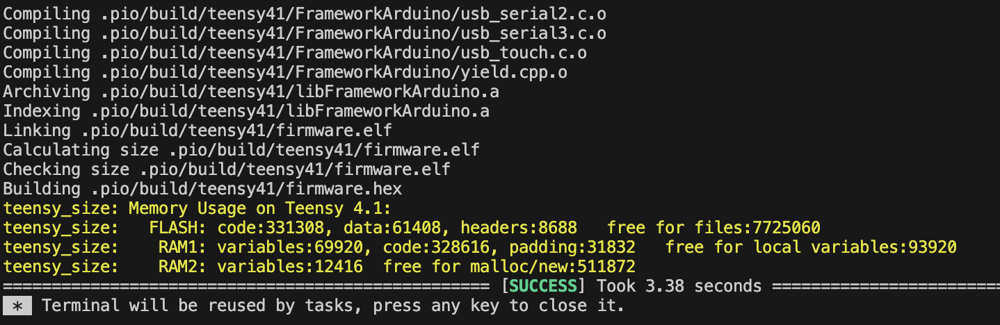
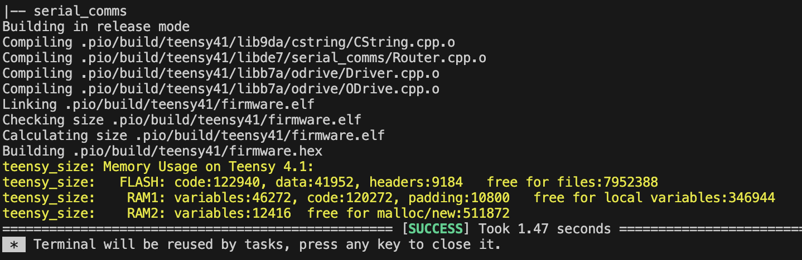

# CString
__A class library that makes it easy to use and manipulate c strings (char arrays), therefore incentivising people to "do things the right way" (because its easy with this lib) and not use Arduino Strings or std::stringstream.__

You can use the CString template class to define a new CString with a predetermined size, or pass in an existing c string with the CStringPtr class.

With the CString and CStringPtr classes, you can use the "<<" to add char* and double to the string. You can also trim the string for any whitespace or newline characters.

No need to worry about buffer overflows, as the library checks for available space and gives the number of bytes it couldn't write.

Published to PlatformIO registry as "CString". 

## Why make this?

This library is the result of trying to avoid the usage of Arduino Strings, which cause heap fragmentation, and the complicated usage of char* AKA "c strings". Therefore, I just made it easy to do it the right way, which is to use c strings.

By replacing Arduino String and std::stringstream usage with this library on a project for a college club (https://github.com/activecontrols/tadpole-software/),
__I ended up increasing available memory by nearly 4x and decreased flash/disk usage by 60%.__ All while making it super easy to do so. The proof is below:

Before CString (tadpole_software, watchdog_timeout_threading branch):

After CString (tadpole_software, string_optimizations branch):
